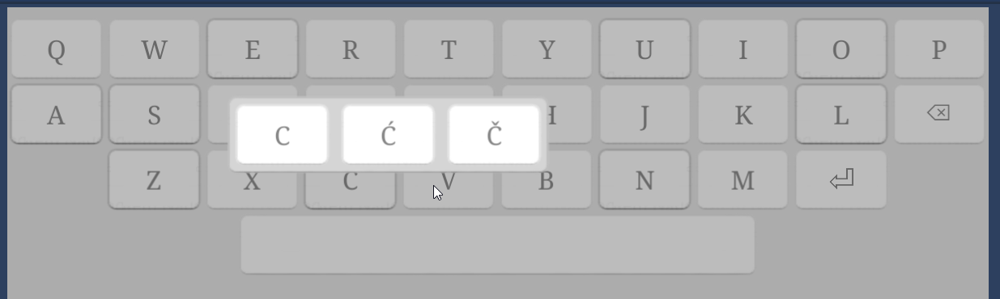

## Simple Keyboard

Add KeyboardInputfieldHelper to your inputfields, it tracks inputfield fodus, and lets SimpleKeyboard know we want to input text.

For the keyboard itselt either grab the prefab or use GameObject menu to Add.

The idea was to keep it as simple as possible.

The only involved thing is the creator, which basically just one click builds the whole keyboard - this is so that it is (hopefully) always going to be easy to have a working keyboard available, even if I loose the prefabs.

You can use Prefabs for Row/Key together with the cretor to seed your keyboard, after this its just two scripts

If you open the keyboard with OpenForInputField, it will control the inputfield. You can also use UnityEvents provided for OnValueChanged and OnEndEdit

There is also support for 'long press to open regional variants of the character' functinality, see demo scene for details;

